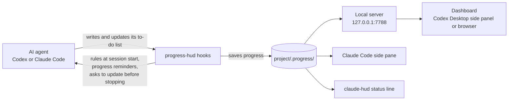

# progress-hud

**English** | [繁體中文](README.zh-TW.md)

A live progress dashboard for AI coding agents. While **Codex** (CLI and Desktop) or **Claude Code** (CLI and Desktop) works through a task, progress-hud reads the agent's to-do list and shows progress at three levels:

- **Project**: overall completion
- **Feature**: completion of each feature (F1, F2, …)
- **Step**: the status of every step inside a feature

```
Website revamp                             43%   3 / 7 done
███████████████░░░░░░░░░░░░░░░░░░░

F1 Product page template            2/3  67%
   ✓ F1.1 Spec table                 verified
   ✓ F1.2 Tab switching
   ▸ F1.3 Image carousel             in progress · Codex
F2 SEO                              1/2  50%
   ✓ F2.1 Meta tags                  marked done, check failed
   ○ F2.2 Sitemap
```

## Quick start

Requires Node.js 20 or newer.

1. Install the plugin for the tools you use:

   ```
   claude plugin marketplace add spboxer3/progress-hud
   claude plugin install progress-hud@progress-hud

   codex plugin marketplace add spboxer3/progress-hud
   codex plugin add progress-hud@progress-hud
   ```

2. Restart Claude Code. In Codex, start a new session, run `/hooks` and trust the progress-hud hooks.
3. Give the agent a task. As soon as it writes its to-do list, progress appears at `http://127.0.0.1:7788` and, in Claude Code, in the side pane (`/progress`).

## How it works



1. The agent plans the task as a to-do list: `update_plan` in Codex; `TodoWrite`, `TaskCreate` / `TaskUpdate` or plan mode in Claude Code.
2. The hooks read every list update, split the steps into features (`F1`, `F2`, …) and steps (`F1.1`, `F1.2`, …), and save them in the project's `.progress/` folder.
3. The dashboard, the Claude Code side pane and the status line all read from that folder, so they always show the same progress.
4. The same hooks keep the agent on track: they give it the step format at the start of each session, and when it edits files without updating progress, they remind it and ask it once to update before it finishes the turn.

## Where you see it

| Tool | Where |
|---|---|
| Codex Desktop | Open `http://127.0.0.1:7788` in the side panel |
| Codex CLI | Type `/progress` (or `$progress`) to start the server and open the dashboard in a browser |
| Claude Code (CLI and Desktop) | The **Project progress** side pane opens on its own once a plan exists; type `/progress` to open it at any time |
| Claude Code with the claude-hud status line plugin | Progress percentage in the status line (optional, see below) |

The dashboard updates live, works at side-panel width, and has a light and a dark theme.

## Requirements

- Node.js 20 or newer, available as `node` on `PATH`
- Codex CLI or Codex Desktop with plugin and hook support, and/or Claude Code
- Git is optional; when the project is a git repository, all worktrees share one progress view

Developed and tested on Windows 11. The hooks, server and dashboard are plain Node.js. The `open` command, the command launcher and the claude-hud status line integration use Windows commands.

## Install

### Claude Code

```
claude plugin marketplace add spboxer3/progress-hud
claude plugin install progress-hud@progress-hud
```

Or inside Claude Code: `/plugin marketplace add spboxer3/progress-hud`, then `/plugin install progress-hud@progress-hud`. Restart Claude Code afterwards.

### Codex (CLI and Desktop)

```
codex plugin marketplace add spboxer3/progress-hud
codex plugin add progress-hud@progress-hud
```

Then start a new Codex session, run `/hooks` and trust the progress-hud hooks. Codex does not run new hooks until you trust them; do this in the CLI and in Desktop.

### Status line (optional, Claude Code with claude-hud)

Type `/progress statusline` in Claude Code, then restart it. If your claude-hud setup already uses `--extra-cmd`, it keeps working: progress-hud runs it and shows its label next to the progress.

### Check the installation

Type `/progress doctor` in Claude Code, or run this in a terminal after the first session has started:

```
%LOCALAPPDATA%\progress-hud\progress.cmd doctor
```

### Updating

```
claude plugin marketplace update progress-hud
codex plugin marketplace upgrade progress-hud
```

### Installing from a local clone instead

```
git clone https://github.com/spboxer3/progress-hud.git
cd progress-hud
node bin/progress.mjs install
```

This registers the clone as a Claude Code plugin folder (`CLAUDE_CODE_PLUGIN_DIRS` in `~/.claude/settings.json`), adds the Codex hooks to `~/.codex/hooks.json`, and adds the claude-hud status line integration. Every file it changes is backed up as `<file>.bak-progress-hud-<timestamp>`. Use either the marketplace or a local clone, not both, or every hook runs twice.

## Writing a plan the dashboard understands

The agent receives these rules at the start of every session. You can also use them in your own prompts.

**Step format**

```
F<n> Feature name › F<n>.<m> Step name
```

```
F1 Product page › F1.1 Spec table
F1 Product page › F1.2 Tab switching
F2 SEO › F2.1 Meta tags
```

- Steps that share `F<n>` belong to the same feature.
- Deeper levels work too: `F1.2.1`.
- `>`, `»` and `→` are accepted in place of `›`.
- Steps without a number go into an **Uncategorized** group. If a plan has three or more steps, the agent is asked to fix the format.

**Optional suffixes**

| Suffix | Effect |
|---|---|
| `[check: file src/spec.js]` | The step counts as *verified* only if this file exists |
| `[check: grep index.html "og:description"]` | The step counts as *verified* only if the file contains the text |
| `[w:3]` | The step counts three times as much toward progress |

Checks only read files inside the project; they never run commands. A step the agent marks done whose check fails is shown in red.

**Claude Code plan mode**: write features as `## F1 Feature name` headings and steps as `- [ ] F1.1 Step name` bullets. Progress is created as soon as you accept the plan.

### When the agent has no to-do tool

Some Codex tool interfaces do not offer `update_plan`. The hooks only see plans the agent writes with a to-do tool, so in that case nothing would be recorded. The rules the agent receives at session start therefore include a ready-to-run command for this session, and the agent uses it instead:

```
progress plan set "F1 Feature › F1.1 Step" "[~] F1 Feature › F1.2 Step" "[x] F1 Feature › F1.3 Step"
progress plan start F1.2
progress plan done F1.2
progress plan add "F1 Feature › F1.4 Step"
progress plan remove F1.4
progress plan show
```

`[~]` marks a step in progress, `[x]` marks it done, and a step without a mark is to do. Run the command in the project folder, or pass `--dir <folder>`. Updates made this way count exactly like `update_plan`: they appear on the dashboard and satisfy the reminders. You can use the same command yourself to correct the progress.

## What the hooks do

| Hook event | What happens |
|---|---|
| `SessionStart` | Gives the agent the to-do list rules and starts the dashboard server if needed. After a resume or a context compaction, also sends the full current plan |
| `UserPromptSubmit` | Sends the agent a one-line progress summary with each of your messages. Saying "pause" stops the reminders until you say "continue" |
| `PostToolUse` | Records every to-do list update (`update_plan` in Codex; `TodoWrite`, `TaskCreate`, `TaskUpdate` and `ExitPlanMode` in Claude Code). Reminds the agent after 8 file edits without a progress update |
| `Stop` | If the agent edited files this turn but never updated progress, asks it once to update before it finishes |

A hook never blocks the agent because of its own failure: errors go to `%LOCALAPPDATA%\progress-hud\hook-error.log`, and the hook still exits successfully.

## Behaviour worth knowing

- **Several agents at once**: each agent session writes its own file, and the dashboard merges them and shows which agent is working on which step.
- **Subagents**: a subagent's to-do list appears under the step the main agent was working on, and never replaces the main plan.
- **Plan rewrites**: when the agent replaces most of the plan, the old plan is kept as an earlier version you can view on the dashboard.
- **New tasks**: when a plan reaches 100% and a plan with different steps starts, the finished one is archived as a milestone.
- **Dropped steps**: steps missing from the agent's latest list are kept and labelled as no longer in the list. They are not deleted and do not count toward progress.
- **Staleness**: the dashboard shows when progress was last updated, and turns yellow when the agent keeps editing files without updating progress for 10 minutes.
- **Cloud-synced folders**: if OneDrive or a similar tool locks a progress file, the write is retried and then saved locally until the next successful write.

## Where data lives

| Path | Contents |
|---|---|
| `<project>/.progress/` | The project's progress. It contains its own `.gitignore`, so it never reaches your repository |
| `%LOCALAPPDATA%\progress-hud\` | The list of known projects, settings, error log, server PID and the `progress.cmd` / `hud-extra.cmd` launchers |

The dashboard server listens on `127.0.0.1` only. It starts when an agent starts working and stops after 12 hours with no progress changes and no open dashboard. To use a different port, set the `PROGRESS_HUD_PORT` environment variable for your user account so that the hooks and the server both see it.

## Commands

In Claude Code:

```
/progress                       Open the side pane
/progress status                Show progress as text
/progress doctor                Check the installation
/progress statusline            Add progress to the claude-hud status line
/progress lang auto|en|zh-TW    Set the interface language
```

In Codex, the plugin adds a `progress` skill. Type `/progress` or `$progress` (or pick **Progress** from `/skills`) to start the server and open the current project's dashboard. Start a new session after installing so Codex loads the skill.

In a terminal, `progress.cmd` points at the installed copy (the hooks keep it up to date):

```
%LOCALAPPDATA%\progress-hud\progress.cmd status [dir]    Show progress as text
%LOCALAPPDATA%\progress-hud\progress.cmd open [dir]      Open the dashboard unless one is already open (--force opens another)
%LOCALAPPDATA%\progress-hud\progress.cmd serve           Run the server in the foreground
%LOCALAPPDATA%\progress-hud\progress.cmd lang [auto|en|zh-TW]
%LOCALAPPDATA%\progress-hud\progress.cmd plan set|start|done|add|remove|show …   Update progress by hand
%LOCALAPPDATA%\progress-hud\progress.cmd statusline
%LOCALAPPDATA%\progress-hud\progress.cmd doctor
%LOCALAPPDATA%\progress-hud\progress.cmd uninstall      Undo a local-clone install and the status line integration
```

Removing the plugin through the marketplace (`claude plugin uninstall` / `codex plugin remove`) keeps every project's `.progress/` folder. Delete those folders yourself if you no longer need them.

## Troubleshooting

| Symptom | What to check |
|---|---|
| `doctor` says Codex has never reported | Trust the hooks with `/hooks` in Codex, then start a new session |
| Dashboard cannot connect | Send any message to the agent, which restarts the server, or run `progress.cmd open` |
| `doctor` shows hook reports but no plan updates | The hooks run, but the agent never wrote a to-do list. If its tool interface has no `update_plan`, it should use `progress plan` (see "When the agent has no to-do tool"); start a new session so it receives the rules again |
| Everything is under Uncategorized | The agent is not using the `F<n> … › F<n>.<m> …` format; start a new session so it receives the rules again |
| Claude side pane does not appear | Restart Claude Code, then type `/progress` |
| Hooks run twice | Both a marketplace install and a local-clone install are active; run `progress.cmd uninstall` to remove the local one |
| Anything else | `%LOCALAPPDATA%\progress-hud\hook-error.log` |

## Language

The interface is available in **English** and **Traditional Chinese**. This covers the dashboard, the Claude Code side pane, the status line, the command-line output, and the rules and reminders the hooks send to the agent.

By default the language follows the system locale: any Chinese locale uses Traditional Chinese, and every other locale uses English. To choose one yourself, type `/progress lang en` (or `zh-TW`, or `auto`) in Claude Code, or run `progress.cmd lang en`.

The dashboard picks up a change within a minute or when you reload it, the agent gets the new language from its next session, and the Claude side pane after a restart. The `PROGRESS_HUD_LANG` environment variable overrides the setting.

Feature and step names are shown exactly as the agent wrote them, in any language. Pause and continue are recognised in both languages, for example "pause" / "暫停" and "continue" / "繼續".

## Development

```
npm test            Hook end-to-end tests and install/uninstall tests
npm run test:pane   Claude Code side pane tests (requires Claude Code)
```

```
.claude-plugin/        Claude Code plugin manifest and marketplace
.agents/plugins/       Codex marketplace
.codex-plugin/         Codex plugin manifest
hooks/hooks.json       Claude Code hooks and side pane module
hooks/codex-hooks.json Codex hooks
codex-skills/          Codex skills (`progress` opens the dashboard)
hooks/register.tsx     Claude Code side pane
bin/hook.mjs           Hook entry for both agents
bin/server.mjs         Dashboard server
bin/progress.mjs       Command-line tool
bin/install.mjs        Local-clone install, status line, uninstall, doctor
lib/core.mjs           Parsing, storage, merging and aggregation
lib/i18n.mjs           Interface text in every language
lib/rules.mjs          To-do list rules sent to the agent
web/index.html         Dashboard
```
